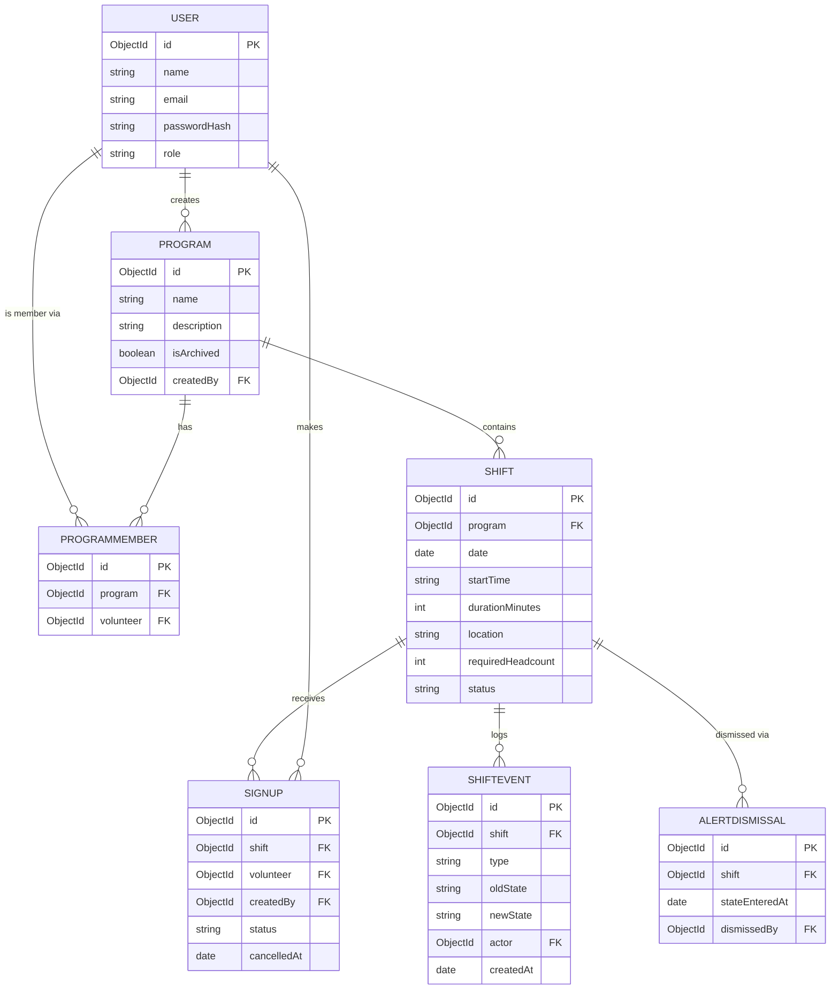

# Schema

## Entity-relationship diagram

## Table by table: columns and types

**User**

| Field          | Type                                     | Notes                                                  |
| -------------- | ---------------------------------------- | ------------------------------------------------------ |
| `_id`          | ObjectId                                 | primary key                                            |
| `name`         | String                                   | required                                               |
| `email`        | String                                   | required, unique, indexed                              |
| `passwordHash` | String                                   | required, bcrypt hash, never returned in API responses |
| `role`         | String enum: `coordinator` | `volunteer` | required                                               |
| `createdAt`    | Date                                     | auto (timestamps)                                      |

**Program**

| Field         | Type                | Notes           |
| ------------- | ------------------- | --------------- |
| `_id`         | ObjectId            | primary key     |
| `name`        | String              | required        |
| `description` | String              |                 |
| `isArchived`  | Boolean             | default `false` |
| `createdBy`   | ObjectId ref `User` | required        |
| `createdAt`   | Date                | auto            |

**ProgramMember** (join collection for the many-to-many)

| Field       | Type                                            | Notes                              |
| ----------- | ----------------------------------------------- | ---------------------------------- |
| `_id`       | ObjectId                                        | primary key                        |
| `program`   | ObjectId ref `Program`                          | required, indexed                  |
| `volunteer` | ObjectId ref `User`                             | required, indexed                  |
| `addedAt`   | Date                                            | auto                               |
| —           | compound unique index on `(program, volunteer)` | prevents duplicate membership rows |

**Shift**

| Field               | Type                                                           | Notes                              |
| ------------------- | -------------------------------------------------------------- | ---------------------------------- |
| `_id`               | ObjectId                                                       | primary key                        |
| `program`           | ObjectId ref `Program`                                         | required, indexed                  |
| `date`              | Date                                                           | required                           |
| `startTime`         | String (`"HH:mm"`)                                             | required                           |
| `durationMinutes`   | Number                                                         | required                           |
| `location`          | String                                                         | required                           |
| `requiredHeadcount` | Number                                                         | required, min 1                    |
| `status`            | String enum: `Open` | `Partially Filled` | `Filled` | `Closed` | denormalized, see below            |
| `createdAt`         | Date                                                           | auto                               |
| —                   | compound index on `(program, date, status)`                    | supports Goal 6 search/filter/sort |

**Signup**

| Field         | Type                                    | Notes                               |
| ------------- | --------------------------------------- | ----------------------------------- |
| `_id`         | ObjectId                                | primary key                         |
| `shift`       | ObjectId ref `Shift`                    | required, indexed                   |
| `volunteer`   | ObjectId ref `User`                     | required, indexed                   |
| `createdBy`   | ObjectId ref `User`                     | who made it — self or a coordinator |
| `status`      | String enum: `active` | `cancelled`     | default `active`                    |
| `cancelledAt` | Date                                    | null unless cancelled               |
| `createdAt`   | Date                                    | auto                                |
| —             | compound index on `(volunteer, status)` | supports the overlap check          |

**ShiftEvent** (append-only history — Goal 9)

| Field                   | Type                                                                   | Notes                                              |
| ----------------------- | ---------------------------------------------------------------------- | -------------------------------------------------- |
| `_id`                   | ObjectId                                                               | primary key                                        |
| `shift`                 | ObjectId ref `Shift`                                                   | required, indexed                                  |
| `type`                  | String enum: `created` | `state_change` | `signup` | `cancel` | `note` | required                                           |
| `oldState` / `newState` | String                                                                 | only populated for `state_change`                  |
| `actor`                 | ObjectId ref `User`                                                    | who caused it                                      |
| `message`               | String                                                                 | optional, for coordinator notes                    |
| `createdAt`             | Date                                                                   | auto — this is the ordering field for the timeline |

**AlertDismissal** (Goal 10 — dismiss/reappear tracking)

| Field            | Type                 | Notes                                                                         |
| ---------------- | -------------------- | ----------------------------------------------------------------------------- |
| `_id`            | ObjectId             | primary key                                                                   |
| `shift`          | ObjectId ref `Shift` | required, indexed                                                             |
| `stateEnteredAt` | Date                 | the timestamp of the specific transition into understaffed that was dismissed |
| `dismissedBy`    | ObjectId ref `User`  |                                                                               |
| `dismissedAt`    | Date                 | auto                                                                          |

## Which relationships are 1:many vs many:many

- **1:many**: `User → Program` (creator), `Program → Shift`, `Shift → Signup`, `User → Signup` (volunteer), `Shift → ShiftEvent`, `Shift → AlertDismissal`.
- **Many:many**: `User ↔ Program`, resolved through the `ProgramMember` join collection — a volunteer can belong to many programs, a program can have many volunteers.

## Which constraints are DB-level vs app-level, and why

- **DB/Mongoose-level**: required fields, the `role` and `status` enums, the unique index on `User.email`, the unique compound index on `(ProgramMember.program, ProgramMember.volunteer)`, and `ref` integrity for lookups/population.
- **App-level**: the fill-state derivation (Open/Partially Filled/Filled from signup count vs headcount), the signup overlap check across a volunteer's other shifts, the Closed-shift lock on further changes, and the alert dismiss/reappear logic. These are multi-document, business-rule checks — Mongo has no native way to express "reject this insert if a related document's time range overlaps," so they're enforced in the service layer before a write happens, not by a schema constraint.

## What I deliberately denormalized

`Shift.status` stores the *current* derived fill-state instead of computing it live from a `Signup` count on every read. It's recalculated and written on every signup/cancel/close. This trades a small amount of write-time work for cheap reads on the endpoints that get hit constantly and read-heavy: Goal 6 (search/filter by state), Goal 8 (dashboard breakdown by state), and Goal 10 (alerts, which filter on state directly). Recomputing it from a `Signup` aggregation on every one of those reads would mean an extra query fan-out on the busiest paths in the app.

## What would break first at 100x data

Two candidates:

1. **The cross-program search endpoint (Goal 6)** — text search over program name + location combined with filters/sort/pagination. At 100x data this needs the compound index on `(program, date, status)` to actually be used by the query planner, and the free-text search over `location` specifically would likely need a proper text index (`$text`) rather than a regex scan, which doesn't use indexes well at scale.
2. **The 8-week dashboard aggregation (Goal 8)** — an unindexed aggregation over `Signup.createdAt` grouped by week would degrade linearly with signup volume; this needs an index on `createdAt` and ideally a pre-aggregated rollup if it ever needs to run more than a few times a minute.

`ProgramMember` and `Signup` growing large are less concerning since their access patterns are always scoped by an indexed foreign key (`program`, `volunteer`, or `shift`), so lookups stay fast even as row counts grow.